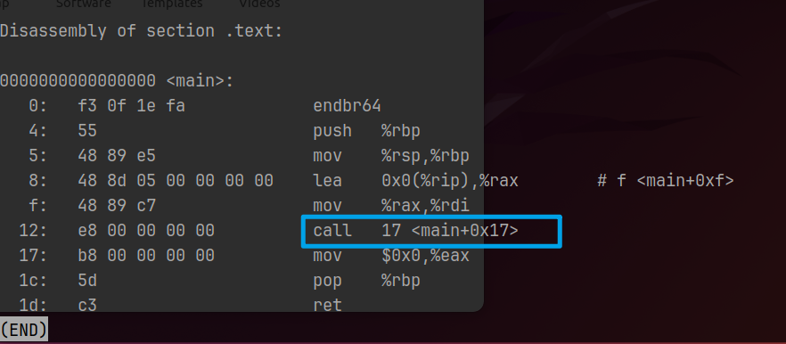
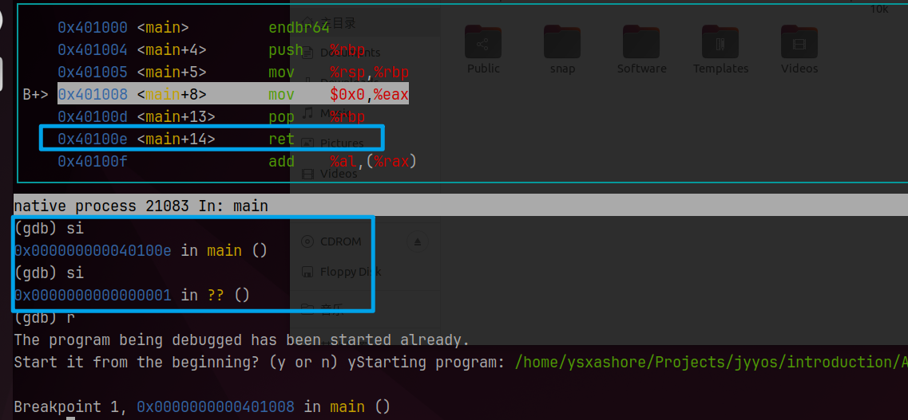
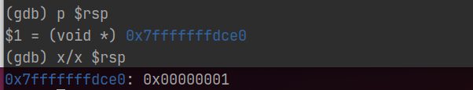
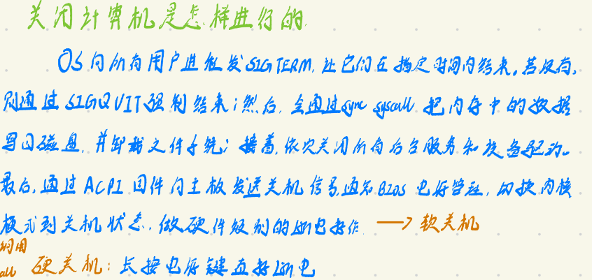
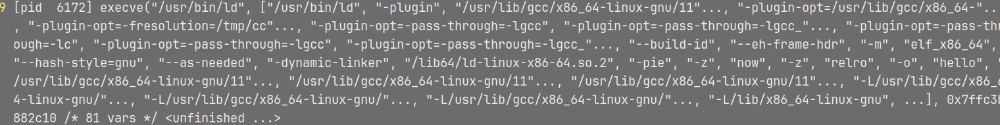
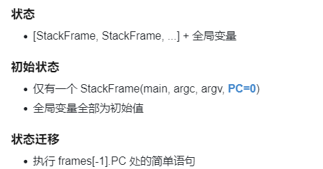

# 应用视角的操作系统

## 最小的应用程序

### 复习相关工具

1. `objdump -d`反汇编
2. `readelf -a`查看所有的ELF信息
3. `--verbose`查看所有的编译选项，可以看到在哪里找头文件 `gcc --verbose hello.c`
   ```c
   #include "..." search starts here:
   #include <...> search starts here:
    /usr/lib/gcc/x86_64-linux-gnu/11/include
    /usr/local/include
    /usr/include/x86_64-linux-gnu
    /usr/include
   End of search list.

   ```
4. `-WL,--verbose`查看所有的链接选项，解释了end符号的由来 `gcc -Wl,--verbose hello.c`
   ```6502&#x20;assembly
   OUTPUT_FORMAT("elf64-x86-64", "elf64-x86-64",
           "elf64-x86-64")
   OUTPUT_ARCH(i386:x86-64)
   ENTRY(_start)
   _end = .; PROVIDE (end = .);


   ```
5. `-static`会静态链接libc库

### 尝试构建最小的hello world

1. **去掉#include**：反汇编行数与之前并没有发生变化

   预处理器会将#include所引用的内容拷贝到所在位置
2. **手动链接**：编译出可重定向文件，然后使用ld进行**链接，报错如下**：
   ```c
   ld: 警告: 无法找到项目符号 _start; 缺省为 0000000000401000
   ld: hello.o: in function `main':
   hello.c:(.text+0x13): undefined reference to `puts'

   ```
   因为，在objdump反汇编中，可重定向文件的call并不知道要跳转到哪里

   
3. **去掉printf，再进行手动链接**：链接成功但是执行失败

   

   可以发现是ret在返回时[^注释1]，直接返回到了0x1处，是程序无法访问的内存。然后发生了段错误

   
   1. `p`命令 查看寄存器信息
   2. `x/x `地址访存
4. **加入while(1)**：正确执行，但是不能退出

   **程序的退出是需要使用Sys\_exit系统调用来进行**

   **处理器这个状态机只会无情的按照pc执行指令，但是指令集中没有规定退出程序/关闭计算机的指令，因此程序中也没有一条退出程序的指令。退出、打印等相应工作的进行都是通过系统调用，发送给操作系统来进行**→**操作系统可以任意改变程序状态**
   > **关闭计算机是怎么进行的？**
   >
   > 
5. 使用汇编语言编写最小的hello world程序

   C语言就可以通过`sys/syscall.h`中的`syscall(long number,...)`函数调用系统调用
   ```c
   #include <sys/syscall.h>

   // The x86-64 system call Application Binary Interface (ABI):
   //     System call number: RAX
   //     Arguments: RDI, RSI, RDX, RCX, R8, R9
   //     Return value: RAX
   // See also: syscall(2) syscalls(2)

   #define syscall3(id, a1, a2, a3) \
       movq $SYS_##id, %rax; \
       movq $a1, %rdi; \
       movq $a2, %rsi; \
       movq $a3, %rdx; \
       syscall

   #define syscall2(id, a1, a2)  syscall3(id, a1, a2, 0)
   #define syscall1(id, a1)  syscall2(id, a1, 0)

   .globl _start
   _start:
       syscall3(write, 1, addr1, addr2 - addr1) //调用sys_write系统调用　写addr1起始的(addr2-addr1)大小的数据
       syscall1(exit, 1) //调用sys_exit退出程序

   addr1:
       .ascii "\033[01;31mHello, OS World\033[0m\n" //重置（消除）所有颜色和图形，然后加粗设置红色
   addr2:

   ```

### 使用strace追踪系统调用

1. 操作系统上的应用程序层次

   Coreutils（Ubuntu使用的是GNU Coreutils）→系统命令ssh、vim、ffmpeg等→VScode、剪辑软件
   - BusyBox（PA中使用的）
   - Toybox
     ```bash
     wget -r -np -nH --cut-dirs=2 -R "index.html*" "https://jyywiki.cn/os-demos/introduction/tar/" --no-check-certificate

     ```
     之后解压`toybox-0.1.0-tar.bz2`，进入toybox-0.1.0内make即可

     make时会报错`toys/mdev.c`内“undefined reference to \`makedev’”，在`toys/mdev.c`内添加头文件`#include <sys/sysmacros.h>`重新编译即可
2. 这些程序都是可执行文件，和minimal.S的可执行文件没有什么区别

   可以在VSCode中安装`Hex Editor`插件来查看并更改二进制文件
3. 使用strace追踪应用程序的系统调用

   `strace -f 进程`追踪进程的系统调用，包括子进程

   可以管道给vim查看`|&`[^注释2]` vim-`，在编辑器中使用`%!grep -v -e -1`[^注释3]去掉非法的系统调用
   ```bash
   wget -r -np -nH --cut-dirs=2 -R "index.html*" "https://jyywiki.cn/os-demos/introduction/strace/" --no-check-certificate
   ```
   通过`make gcc-demo |& vim-`可以看到gcc使用SYS\_execve系统调用，调用了外部的as和ld来进行汇编和链接

   

   

   通过make xedit-demo知道了绘制也是通过系统调用进行的，write显示缓冲区 read键盘read光标

## 理解高级语言程序

### Simple C解释器

Simple C的每一条语句都至多做一次运算，且条件语句中不包含运算

可以构建状态机为：



- 状态是栈帧的集合+全局变量，每一个栈帧中存储着要执行的函数，参数**以及执行到的PC值**

  有了PC，这样从函数返回时，才知道从哪继续执行
- 初始状态：栈帧集合中只有一个栈帧，即为main的栈帧，PC为0；全局变量为初始值
- 状态迁移：执行栈顶栈帧的PC处语句

下面以汉诺塔为例，构建Simple C状态机：

- 不使用状态机的汉诺塔实现

  将n个盘子从A经B移到C，可以先将n-1个盘子移到B，再把最后的一个盘子移到C，之后再将n-1个B上的盘子经A移到C
  ```c
  #include <stdio.h>

  int hanoi(int n, char from, char to, char via) {
      if (n == 1) {
          printf("%c -> %c\n", from, to);//只有一个盘子，把它从from移到to
          return 1;
      } else {
          int c1 = hanoi(n - 1, from, via, to);//先把n-1个盘子移到中间
          hanoi(1, from, to, via);//然后把１个盘子移到to
          int c2 = hanoi(n - 1, via, to, from);//最后再把n-1个在中间的盘子移到to
          return c1 + c2 + 1;
      }
  }

  ```
- 使用状态机的汉诺塔实现
  - 定义栈帧结构体
    ```c
    struct Frame {
        // Each frame has a program counter to keep track its next
        // to-be-executed statement.
        int pc;

        // The internal state of the frame. This state includes
        // both arguments and local variables (if any).
        //
        // Arguments:
        // 按照递归实现的汉诺塔，函数的参数有n from to via
        // 函数内部使用的局部变量包括c1,c2
        int n;
        char from, to, via;

        // Local variables:
        int c1, c2;
    };

    ```
  - 定义栈帧集合以及栈顶指针
    ```c
    Frame stk[64]; //栈帧集合
    Frame *top = stk - 1; //top指向栈顶，没有元素时定义为栈起始-栈帧大小
    ```
  - 定义宏，实现函数调用和函数返回
    ```c
        // Function call: push a new frame (PC=0) onto the stack
        // 调用函数，相当于新入栈一个栈帧，因为栈起始定义为stk-1
        // 所以这里需要先递增栈顶指针，再入栈frame
        #define call(...) ({ *(++top) = (Frame){.pc = 0, __VA_ARGS__}; })
        
        // Function return: pop the top-most frame
        // 从函数中返回相当于出栈　val中是返回值
        #define ret(val) ({ top--; retval = (val); })

    ```
  - 定义函数返回值以及初始化栈
    ```c
        // The last function-return's value. It is not obvious
        // that we only need one retval.
        int retval = 0;

        // The initial call to the recursive function
        call(n, from, to, via);

    ```
  - 状态更迭

    **每次取栈顶的栈帧PC**执行，根据PC所在的位置，决定它是要call还是赋值中间变量还是返回。执行完后，递增PC
    ```c
       while (1) {
            // Fetch the top-most frame.
            // 获取栈顶指针
            Frame *f = top;
            if (f < stk) { //栈空
                // No top-most frame any more; we're done.
                break;
            }

            // Jumps may change this default next pc.
            int next_pc = f->pc + 1;

            // Single step execution.

            // Extract the parameters from the current frame. (It's
            // generally a bad idea to reuse variable names in
            // practice; but we did it here for readability.)
            // 从栈帧中获得参数
            int n = f->n, from = f->from, to = f->to, via = f->via;

            // 基本上是按照递归的汉诺塔函数内部实现
            switch (f->pc) {
                case 0:
                    if (n == 1) {
                        printf("%c -> %c\n", from, to);
                        ret(1);
                   　 }
                    break;
                case 1: call(n - 1, from, via, to); break;
                case 2: f->c1 = retval; break;
                case 3: call(1, from, to, via); break;
                case 4: call(n - 1, via, to, from); break;
                case 5: f->c2 = retval; break;
                case 6: ret(f->c1 + f->c2 + 1); break;
                default: assert(0);
            }

            f->pc = next_pc; //写PC
        }

    ```
  - 最后返回最终的返回值

    `return retval`

> 🖍️**C/C++中的函数和数学中的函数的区别**
>
> 例如，可以把Fibonacci 数列的递归公式写成下式，但是汉诺塔不行
>
> ```c++
> // 也可以 return f(n - 2) + f(n - 1)
> ;return f(n - 1) + f(n - 2);
> ```
>
> 不行的根本原因在于**汉诺塔中的 printf 会带来全局的副作用，需要按照顺序输出。** C/C++ 遵循 “顺序执行” 的原则，函数的执行有 “先后” （不像数学的函数，先后是无关的），**按照不同顺序调用会导致程序输出不同的结果**。而在具体实现时，每个栈帧中存放的 “当前执行的位置” （PC） 实现了顺序执行

## 编译器与编译优化

### 编译器

**编译的过程实际上是把“C语言的状态机”翻译成“汇编语言的状态机”，也就是说编译器实际上是状态机之前的翻译器**

以Simple C来说，它的编译涉及到一下三个方面：

- 运算：操作数load到寄存器、然后使用对应的操作符进行运算，最后Store到内存中
- 分支：条件转移指令
- 函数调用：使用`栈帧寄存器stackpoint`，读取内存中的栈帧

[My\_C\_Compiler](https://www.wolai.com/xbWCaKVEWLVfjRhmBusrNM "My_C_Compiler")

> 由于Simple C这种直接翻译的性质，将C语言又称之为“高级汇编语言”——存在C代码到指令集的直接对应关系，状态机和迁移都可以“直译”

### 编译优化

C 语言编译器在进行代码优化时，**遵循的基本准则是在不改变程序的语义（即程序的行为和输出结果）的前提下，提高程序的执行效率和/或减少程序的资源消耗**[^注释4]。其中，最重要的“三板斧”是：

- **函数内联：将函数调用替换为函数体本身的内容**
- **常量传播：在编译时计算常量表达式的值并替换**
- **死代码消除：删除永远不会被执行到的代码**

而编译器一般不优化的部分包括：

- **本执行文件内的系统调用**
- **外部函数调用（未知代码，可能内部存在系统调用）**
- **编译器提供的不可优化标注：volatile、有函数间隔的load、store以及inline assembly**

> **但是这样的编译器优化原则是有点保守的**
>
> 例如，下面的代码，编译器不好将其合并为一个printf，通过write系统调用写全部字符
>
> ```c
> if (n <= 26) {
>     for (int i = 0; i < n; i++) {
>         putchar('A' + i);
>     }
> }
> ```
>
> **因此，在现在的操作系统中存在着一种新的方向：将状态机的一部分直接放在操作系统中运行**
>
> 1. 把代码放进操作系统中执行：XRP
> 2. 单个应用就是一个操作系统：Unikernel


[^注释1]: 从栈顶取出64位的PC：pc<-M\[rsp]
    然后栈顶+8，出栈rsp+=8

[^注释2]: 2 >&1 |

[^注释3]: -e指定多个搜索匹配模式
    -e "hello" -e "yes"

[^注释4]: 以状态机的视角来看：只要系统调用序列不变，其他的优化都是允许的
