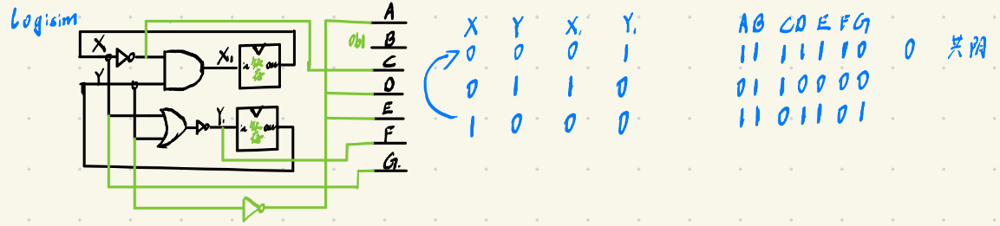
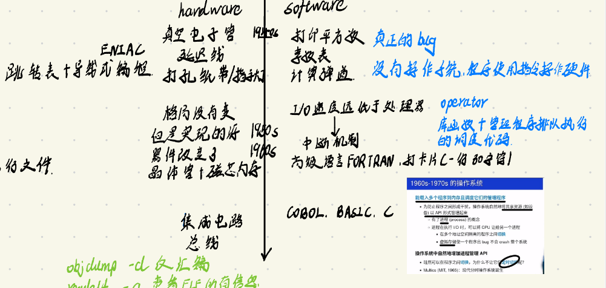

# 操作系统概述

## 目录

- [为什么要学习操作系统](#为什么要学习操作系统)

- [什么是操作系统？](#什么是操作系统)

- [怎么理解操作系统](#怎么理解操作系统)
  - [硬件——logisim](#硬件logisim)
    - [代码细节](#代码细节)

  - [软件——mini-rv32ima](#软件mini-rv32ima)
    - [main.c](#mainc)

    - [mini-rv32ima.h](#mini-rv32imah)

  - [硬件与软件的发展历史](#硬件与软件的发展历史)


## 为什么要学习操作系统

像学习微积分、离散数学那样，重走从无到有的发现历程，理解学科中的**基本动机**、**基本方法**、**里程碑**以及**走过的弯路**。最终达到**应用、创新和革命**的目的

操作系统的基本动机：更快更好地服务更多的应用

操作系统的基本方法：“Building Abstract”

操作系统的里程碑：Unix和Linux

## **什么是操作系统？**

不用进行精准的定义，因为哪怕以“管理计算机软件/硬件资源，为程序提供服务”的程序来定义也是模糊的。如下图所示，通过放宽对硬件和软件的设定限制，可以得到不同的操作系统：


***

## **怎么理解操作系统**

定义是对“全部”含义的精简表达，而理解操作系统的“全部”，就需要理解它发展的历史——**以硬件和软件的发展历史，来看中间层即操作系统的发展**

### **硬件**——logisim

《数字逻辑电路》所了解到一个**由导线、时钟、逻辑门、寄存器构成的极简的公理系统**，能够支撑非常复杂的数字系统设计。下面的logisim程序模拟数字电路的执行过程，它也是 [nvboard](https://github.com/NJU-ProjectN/nvboard "nvboard") 的基本原理。这个例子还展示了 UNIX Philosophy 中命令行工具的**协作原理**——C 程序 logisim 输出类似 `A=0; B=1; ...` 的数码管状态，而另一个程序负责解析这些输出并真实地 “画” 出来。

```bash
wget -r -np -nH --cut-dirs=2 -R "index.html*" "https://jyywiki.cn/os-demos/introduction/logisim/" --no-check-certificate

```

#### 代码细节

1. 通过C语言来抽象电路的思想
   ```c
   #include <stdio.h>
   #include <stdbool.h>
   #include <unistd.h>

   // Wires
   // A wire in digital circuits is used to connect different components
   // together, allowing the transmission of electrical signals between them.
   // A wire is represented as a boolean value (true or false), which
   // corresponds to high (1) and low (0) voltage levels in a real circuit.
   typedef bool wire;

   // Flip-flops
   // A basic memory element in digital circuits, capable of storing one bit
   // of data. It has an input and an output (wires), and it maintains its
   // output value until the input changes and a clock signal is received.
   typedef struct
   {
       bool value; // The current value stored in the flip-flop
       wire *in;   // Pointer to the input wire
       wire *out;  // Pointer to the output wire
   } reg;

   // Logical gates from NAND
   // NAND gate is a fundamental building block in digital electronics. Using
   // NAND gates, one can construct any other logical operation.

   // NAND gate: Returns true unless both inputs are true.
   #define NAND(X, Y) (!((X) && (Y))) // 可以由NAND构成所有的逻辑电路

   // NOT gate: Inverts the input.
   #define NOT(X) (NAND(X, 1))

   // AND gate: Returns true only if both inputs are true.
   #define AND(X, Y) (NOT(NAND(X, Y)))

   // OR gate: Returns true if at least one input is true.
   #define OR(X, Y) (NAND(NOT(X), NOT(Y)))

   // Clock cycles
   // In digital circuits, a clock signal is used to synchronize operations.
   // This infinite loop mimicks the continuous nature of a clock signal in
   // a real circuit. We assume that all flip-flops are updated simultaneously
   // on the end of a cycle.
   /* 这个无限循环模拟了真实电路中时钟信号的连续性。我们假定在一个周期结束时，所有的触发器会同时更新。
    */
   #define CLOCK_CYCLE while (1)

   ```
   1. **导线：用布尔型bool抽象Verilog中的wire**
   2. **时钟：while(1)循环进行抽象Verilog中的clk**
   3. **逻辑门：定义宏，直接对导线进行操作**

      通过NAND逻辑门可以构造其他任意的逻辑门
   4. **寄存器：用包含三个成员的结构体抽象Verilog中的reg**

      这三个成员分别是寄存器所寄存的值，输入连接的值，输出连接的值——输入输出均使用指针变量
2. 代码所表示的电路图以及真值表

   
3. python中的[exec函数](exec函数_42gHqFb4WmUaADxUDLH5yt.md "exec函数")

   在本项目中的使用方式是`exec(line, (ctx := {}))`，使用到了**海象运算符****`:`**`=`，**海象运算符可以实现赋值并返回，缩短代码行数，所赋值的变量作用域等同于代码所在位置**。而在这个例子中，**通过****`(ctx := {})`****创建的字典作为全局命名空间，代码****`line`****在这个全局命名空间中执行，并且变量****`ctx`****也可以在后续的代码中用于访问和处理这个全局命名空间中的内容（每次执行时都先初始化为空）**。例如，如果`line`是一段代码，它在执行过程中定义了新的变量，这些变量将会存储在`ctx`这个字典中

   **如果不使用海象运算符，那么需要分两行代码**。但是这样可以保存所有line的执行结果。而不是每次都重新从一个空字典中保存
   ```python
   ctx = {}
   exec(line,ctx)
   ```
4. 终端颜色控制+清屏+设置光标

   [终端输出颜色控制](终端输出颜色控制_eCpjfL23GsBYwVDHxN7cu3.md "终端输出颜色控制")

   `\033[2J`清屏

   `\033[1;1f `设置光标在左上角

   `░`和`█`色块的使用

### 软件——mini-rv32ima

```bash
wget -r -np -nH --cut-dirs=2 -R "index.html*" "https://jyywiki.cn/os-demos/introduction/mini-rv32ima/" --no-check-certificate
```

要我自己写，肯定写不出来，但是还是很容易看懂的

#### **main.c**

- **宏定义**
  ```c
  #define RAM_SIZE (64 * 1024 * 1024) // Just default RAM amount is 64MB.
  #define RAM_TEXT_START 0
  #define RAM_TEXT_END RAM_STACK_START
  #define RAM_STACK_START (RAM_SIZE / 2) // 栈大小为32MB　代码最大也是32MB
  #define RAM_STACK_END RAM_SIZE // 栈初始位置
  ```
  定义了RAM的大小为64MB，并将RAM中的内容分为两部分：代码段+栈段。每段均为32MB
- `void DumpState(struct CPUState *core)`打印当前的CPU状态（**PC+全部寄存器+CSR中的CYCLEL、CYCLEH、EXTRAFLAGS+栈内容**）
  ```c
  struct CPUState
  {
      // Processor internal state
      uint32_t regs[32], csrs[CSR_COUNT]; //枚举按次序从0增加，因此CSR_COUNT恰好为之前的CSR数量

      // Memory state
      uint8_t *mem;
      uint32_t mem_offset, mem_size;
  };

  void DumpState(struct CPUState *core)
  {
      uint32_t pc = core->csrs[PC];
      uint32_t pc_offset = pc - RAM_TEXT_START;
      uint32_t ir = 0;
      printf(" PC:%08x", pc);
      if (pc_offset >= 0 && pc_offset < RAM_TEXT_END - 3) // 4B一个指令长度
      {
          ir = *((uint32_t *)(&((uint8_t *)core->mem)[pc_offset]));
          printf(" [%08x]", ir);
      }
      else // 否则指令PC越界
      {
          printf(" [xxxxxxxx]");
      }
      printf("\n");
      uint32_t *regs = core->regs;
      printf("  Z:%08x  ra:%08x  sp:%08x  gp:%08x\n", regs[Z], regs[RA], regs[SP], regs[GP]);
      printf(" tp:%08x  t0:%08x  t1:%08x  t2:%08x\n", regs[TP], regs[T0], regs[T1], regs[T2]);
      printf(" s0:%08x  s1:%08x  a0:%08x  a1:%08x\n", regs[S0], regs[S1], regs[A0], regs[A1]);
      printf(" a2:%08x  a3:%08x  a4:%08x  a5:%08x\n", regs[A2], regs[A3], regs[A4], regs[A5]);
      printf(" a6:%08x  a7:%08x  s2:%08x  s3:%08x\n", regs[A6], regs[A7], regs[S2], regs[S3]);
      printf(" s4:%08x  s5:%08x  s6:%08x  s7:%08x\n", regs[S4], regs[S5], regs[S6], regs[S7]);
      printf(" s8:%08x  s9:%08x s10:%08x s11:%08x\n", regs[S8], regs[S9], regs[S10], regs[S11]);
      printf(" t3:%08x  t4:%08x  t5:%08x  t6:%08x\n", regs[T3], regs[T4], regs[T5], regs[T6]);
      uint32_t *csrs = core->csrs;
      printf("CYCLEL:%08x CYCLEH:%08x EXTRAFLAGS:%08x\n", csrs[CYCLEL], csrs[CYCLEH], csrs[EXTRAFLAGS]);
      printf("stack (sp:%08x):\n", regs[2]);
      for (int sp = regs[2]; sp < core->mem_size; sp += sizeof(int32_t)) // 打印栈内容
      {
          printf("%08x: %08x\n", sp, core->mem[sp]);
      }
      printf("%#08x\n", RAM_STACK_END);
      printf("\n");
  }
  ```
- `int xtoi(char *s)`十六进制转十进制
  ```c
  int xtoi(char *s) // 十六进制转十进制
  {
      int res = 0;
      for (int i = 2; s[i]; i++) // 0x------ 从高位开始转换
      {
          res *= 16; // (res+多少)*16
          if (s[i] >= 'a' && s[i] <= 'f')
              res += s[i] - 'a' + 10;
          else 
              res += s[i] - '0';
      }
      return res;
  }
  ```
  首先，因为需要去掉字符串中“0x”，所以i从2开始到空字符

  然后，采用的是从高位到低位的转换思想，每一位都先乘以16再加上这位代表的数值
- `int main(int argc, char **argv)`
  1. 首先，main函数的执行至少需要两个参数（argv\[0]是当前脚本名称，argv\[1]是指定的可执行文件名称）
     ```c
         // get the testcase
         if (argc < 2)
         {
             printf("Usage: ./mini-rv32ima <path_testcase> <arg1> <arg2> ... <argn>\n");
             printf("- The testcase file should be a rv32i binary with 0 offset to the first line of instruction.\n");
             printf("- Note that we only support dec/hex int-type mainargs for simplicity.\n");
             return 0;
         }
     ```
  2. 然后，从第一个参数中获取mini-rv32ima所要执行的可执行文件名称
     ```c
         char *image_filename = argv[1];
         printf("[mini-rv32ima] load image file: %s\n", image_filename);
     ```
  3. 接着，初始化CPUState变量，并设置mem相关变量以及PC的初始值
     1. CPUState内变量都初始化为0
     2. 为mem指针分配RAM\_SIZE字节大小空间，并初始化为0
     3. 初始化mem\_offset、mem\_size以及PC
     ```c
         // allocate ram image
         struct CPUState state;
         printf("[mini-rv32ima] alloc ram size = %#x\n", RAM_SIZE);
         memset(&state, 0, sizeof(state));
         state.mem = malloc(RAM_SIZE);
         if (!state.mem)
         {
             fprintf(stderr, "Error: failed to allocate ram image.\n");
             return 1;
         }
         memset(state.mem, 0, state.mem_size);
         state.mem_offset = RAM_TEXT_START;
         state.mem_size = RAM_SIZE;
         state.csrs[PC] = state.mem_offset;
     ```
  4. 读取指定的可执行文件的指令序列`flen`字节内容到`state.mem + RAM_TEXT_START`
     ```c
     // load insts from testcase
         FILE *f = fopen(image_filename, "rb");
         if (!f || ferror(f))
         {
             fprintf(stderr, "Error: image file \"%s\" not found\n", image_filename);
             return 1;
         }
         fseek(f, 0, SEEK_END);
         long flen = ftell(f); // 获得文件大小
         fseek(f, 0, SEEK_SET);
         if (flen > RAM_TEXT_END - RAM_TEXT_START)
         {
             fprintf(stderr, "Error: image file size too big (%#lx bytes)\n", flen);
             fclose(f);
             return 1;
         }
         if (fread(state.mem + RAM_TEXT_START, flen, 1, f) != 1)
         {
             fprintf(stderr, "Error: Failed to load image file\n");
             return 1;
         }
         fclose(f);
     ```
  5. 获得可执行文件参数，最多4个

     首先，将运行命令中的参数获取出来，存储到margs中
     ```c
     #define MAX_MAINARGS 4
         if (argc > 2 + MAX_MAINARGS)
         {
             printf("[mini-rv32ima] WARN: mainargs should <= %d, the excess ones will be discarded\n", MAX_MAINARGS);
         }
         int margc = (argc > 2 + MAX_MAINARGS ? MAX_MAINARGS : argc - 2); // 前两个参数是指定运行文件和image文件
         int margs[MAX_MAINARGS] = {0};
         printf("[mini-rv32ima] mainargs:\n");
         for (int i = 0; i < margc; i++)
         {
             if (argv[2 + i][0] == '0' && argv[2 + i][1] == 'x')
             {
                 margs[i] = xtoi(argv[2 + i]);
             }
             else
             {
                 margs[i] = atoi(argv[2 + i]);
             }
             printf("%s - %d\n", argv[2 + i], margs[i]);
         }
     ```
     然后，将这些参数保存到堆栈中

     栈是向下的，因此栈指针应该设置为`RAM_STACK_END - margc * sizeof(int32_t)`

     然后，将栈指针保存到sp寄存器中，并设置参数值到寄存器中（为什么既要保存到SP又要保存到A1）
     ```c
         uint32_t sp = RAM_STACK_END - margc * sizeof(int32_t);
         memcpy(state.mem + sp, margs, RAM_STACK_END - sp); // 将参数存储在栈中 memcpy的len应该是字节 这里也可以替换成margc * sizeof(int32_t)
         state.regs[SP] = sp; //传递栈指针
         state.regs[A0] = margc; // 传参 A0指定个数 A1指定栈指针
         state.regs[A1] = sp; 
     ```
  6. 执行指令序列
     ```c
         // do emulation
         printf("initially:\n");
         DumpState(&state); // 打印初始状态
         int ret;
         int debug_climit = 10000; // 手动设置最多可执行时钟限制,防止死循环
         do
         {
             ret = rv32ima_step(&state, 1); // mini-rv32ima.h中定义的内联函数——核心函数
             if (ret != 0)
                 printf("minirv32ima ret=%d !=0\n", ret);
             // DumpState(&state);
             if (--debug_climit <= 0)
             {
                 fprintf(stderr, "Error: debug_climit exceed\n");
                 break;
             }
         } while (ret == 0 && state.csrs[PC] != 0); // 当ret不为0或者PC为0时结束循环
         printf("finally:\n");
         DumpState(&state);
     ```

#### **mini-rv32ima.h**

1. 定义通用寄存器的汇编名称（与通用名称、ABI约定的索引位置一一对应）
   ```6502&#x20;assembly
   // riscv32 寄存器定义通用名称和汇编名称
   enum RV32IMA_REG
   {
       Z, // x0: Zero Register.
          //     Always wired to 0 and ignores writes.
       RA, // x1: Return Address.
           //     Used by convention to store the return address in function
           //     calls. jal and jalr store the address to return.
       SP, // x2: Stack Pointer.
           //     Points to the top of the stack in memory.
       GP, // x3: Global Pointer.
           //     Typically points to the middle of the global data segment.
       TP, // x4: Thread Pointer.
           //     Used for thread-local storage.
       T0, // x5-x7: Temporary Registers.
       T1, //     Temporary storage by assembly code and compilers. Do not need
       T2, //     to be preserved across function calls.
       S0, // x8-x9: Saved Registers.
       S1, //     Store values that should be preserved across function calls.
           //     S0 is also known as FP (Frame Pointer) in some calling
           //     conventions.
       A0, // x10-x17: Argument Registers.
       A1, //     Eight arguments to functions.
       A2, //     A0 and A1 are also used to return values from functions
       A3,
       A4,
       A5,
       A6,
       A7,
       S2, // x18-x27: More Saved Registers.
       S3, //     Like S0 and S1, these registers are used to store values that
       S4, //     need to be preserved across function calls
       S5,
       S6,
       S7,
       S8,
       S9,
       S10,
       S11,
       T3, // x28-x31: More Temporary Registers.
       T4, //     Like T0-T2, their values do not need to be preserved across
       T5, //     function calls
       T6,
   };
   ```
2. 定义CSR的名称，这里把PC也作为CSR

   利用枚举变量默认从0递增的特点，最后的CSR\_COUNT恰为所定义的CSR个数。这里把PC也作为了一个CSR，且加入了ABI中没有的EXTRAFLAGS和拆分的MIE
   ```c
   // riscv32 CSR
   // 把PC也作为了一个CSR
   enum RV32IMA_CSR
   {
       PC,          // Program Counter: Address of the current instruction
       MSTATUS,     // Machine Status Register: Global interrupt enable,
                    // previous privilege mode, and other status bits
       CYCLEL,      // Cycle Counter Low: Lower 32 bits of the cycle counter;
                    // counts the number of cycles since reset
       CYCLEH,      // Cycle Counter High: Upper 32 bits of the cycle counter
       TIMERL,      // Timer Low: Lower 32 bits of the real-time counter;
                    // increments at a constant rate
       TIMERH,      // Timer High: Upper 32 bits of the real-time counter
       TIMERMATCHL, // Timer Match Low: Lower 32 bits of the timer match register
                    // for setting timer interrupts
       TIMERMATCHH, // Timer Match High: Upper 32 bits of the timer match register
       MSCRATCH,    // Machine Scratch: Scratch register for trap handler
       MTVEC,       // Machine Trap-Vector Base-Address Register: Base address of
                    // the trap vector
       MIE,         // 拆分了mstatus Machine Interrupt Enable: Which interrupts are enabled
       MIP,         // Machine Interrupt Pending: Which interrupts are pending
       MEPC,        // Machine Exception PC: Address to return to after exception
       MTVAL,       // Machine Trap Value: Additional information about the trap
       MCAUSE,      // Machine Cause Register: The cause of the last trap
       EXTRAFLAGS,  // Extra Flags: Processor internal decode states
                    // (not part of the standard RISC-V specification)

       CSR_COUNT, // Number of CSRs: Utility value; the number of CSRs
                  // (Comments above are generated by GPT)
   };

   ```
   - TIMERMATCHH/L

     `TIMERMATCHH/L`通常与定时器功能相关。它主要用于存储定时器匹配值，当定时器计数值大于`TIMERMATCHH/L`中存储的值时，会触发相应的中断
   - MIE：对应于MIP的局部中断使能
   - MIP

     MIP用于指示机器模式下正在等待处理的中断，每一位通常都对应一个中断/异常事件

     第8位：时钟中断
   - MTVAL：关于Trap的附加信息
   - EXTRAFLAGS

     1...0：表示当前机器模式，3是USER，0是KERNEL

     2：WFI，当处理器执行到设置了 WFI 位的指令时，处理器会进入一种低功耗等待状态，直到触发中断后，才将其置为0

     3+：Load/Store reservation LSBs.
3. CPU\_state结构体，之前已提及
4. `static inline int32_t rv32ima_step(struct CPUState *state, uint32_t elapsedUs)`
   - **参数解析**

     state是main.c中创建的CPU\_state结构体指针

     elapsedUS在main.c中设置为1，表示执行一条指令过去的时间，用于更改时钟CSR
   - **读GR、CSR、MEM的宏定义**
     ```c
     #define CSR(x) (state->csrs[x])
     #define REG(x) (state->regs[x])
     #define MEM(x) (&state->mem[x]) // MEM是读的对应mem的x单元的地址
     ```
   - **根据elapsedUS调整时钟CSR**

     64位计数器分高32位和低32位，分别存储在TIMERH和TIMERL中。因此对TIMERL的递增需要考虑溢出——当前值加1小于当前值，然后递增TIMERH
     ```c
         // 对定时器CSR进行调整
         uint32_t new_timer = CSR(TIMERL) + elapsedUs;
         if (new_timer < CSR(TIMERL)) // 发生了溢出
             CSR(TIMERH) = CSR(TIMERH) + 1;

         CSR(TIMERL) = new_timer;
     ```
   - **检测时钟中断是否发生并处理**
     ```c
         // Handle Timer interrupt.

         uint64_t timer = ((uint64_t)CSR(TIMERH) << 32) | CSR(TIMERL);
         uint64_t timermatch = ((uint64_t)CSR(TIMERMATCHH) << 32) | CSR(TIMERMATCHL); // timer macth reg是用来触发时钟中断的

         // 对TIMERMATCH设置了有效值以后才能进行时钟中断 当timer>timermatch时触发中断
         if ((CSR(TIMERMATCHH) || CSR(TIMERMATCHL)) && (timer > timermatch))
         {
             CSR(EXTRAFLAGS) &= ~4; // EXTRAFLAGS的第三位表示等待中断状态,发生中断则需要将该位置0
             CSR(MIP) |= 1 << 7;    // mip的第八位表示时钟中断，置１发起中断请求
         }
         else
         {
             CSR(MIP) &= ~(1 << 7); // 没有时钟中断
         }

         // If WFI (waiting for interrupt), don't run processor.
         // Note: only a few bits are used.  (Machine = 3, User = 0)
         // Bits 0..1 = privilege.
         // Bit 2 = WFI (Wait for interrupt)
         // Bit 3+ = Load/Store reservation LSBs.
         if (CSR(EXTRAFLAGS) & 4) // 如果WFI仍有效,那么停止处理器的运行
             return 1;
     ```
     ```c
         uint32_t trap = 0; //NO
         uint32_t rval = 0; //操作返回值
         uint32_t pc = CSR(PC); //当前PC
         uint32_t cycle = CSR(CYCLEL); //当前的时钟周期

         // Timer interrupt. mstatus全局中断使能　mie局部使能　且有时钟中断　
         // trap
         //    1:code 0,PC-misaligned PC非对齐异常 需要保存PC到mtval
         //    2:code 1,access violation on instruction read 读指令越界异常 需要保存pc到mtval
         //    3:code 2,指令opcode无效 需要保存PC到mtval
         //    4:code 3,ebreak 断点
         //    5:code 4,load地址未对齐 未实现
         //    6:code 5,LOAD访存地址无效异常(可以访问CPU_state中的mem以及0x10000000~0x12000000的外设地址，目前只有定时器外设0x1100bffc 0x1100bff8),需要保存访存地址到mtval
         //    7:code 6,store/AMO地址未对齐 未实现
         //    8:code 7,STORE/AMO访存地址无效异常(可以访问CPU_state中的mem以及0x10000000~0x12000000的外设地址，目前只有时钟匹配寄存器 0x11004004 0x11004000和SYSCON 0x11100000) 需要保存访存地址到mtval
         //    9:code 8,用户U模式下的系统调用
         //   10:code 9,S模式下的系统调用 未实现
         //   11:code 10,保留
         //   12:code 11,机器M模式下的环境调用
         //   5-6-7-8需要保存访存地址，其余保存pc
         if ((CSR(MIP) & (1 << 7)) && (CSR(MIE) & (1 << 7) /*mtie*/) && (CSR(MSTATUS) & 0x8 /*mie*/))
         {
             trap = 0x80000007; // 陷入NO
             pc -= 4;           // 返回pc
             goto cycle_end;
         }
     ```
   - **cycle\_end中断异常处理+设置时钟以及下一个PC**
     ```c
     cycle_end:
         // Handle traps and interrupts.
         if (trap)
         {
             if (trap & 0x80000000) // 是中断而不是陷入
             {                      // It's an interrupt, not a trap.
                 CSR(MCAUSE) = trap;
                 CSR(MTVAL) = 0;
                 pc += 4; // PC needs to point to where the PC will return to.　当前pc已经执行完成需要+4
             }
             else
             {
                 CSR(MCAUSE) = trap - 1;
                 CSR(MTVAL) = (trap > 5 && trap <= 8) ? rval : pc;
             }
             CSR(MEPC) = pc; // 返回pc
             // On an interrupt, the system moves current MIE into MPIE
             // mstatus的MIE到MPIE,没有禁止MIE说明支持多重中断　当前机器模式到ｍstatus的MPP
             CSR(MSTATUS) = ((CSR(MSTATUS) & 0x08) << 4) | ((CSR(EXTRAFLAGS) & 3) << 11);
             pc = (CSR(MTVEC) - 4); // 获得中断服务程序地址

             // If trapping, always enter machine mode.
             CSR(EXTRAFLAGS) |= 3; // 进入机器模式

             trap = 0; // 恢复NO
             pc += 4;  // 可以上面不减4
         }

         if (CSR(CYCLEL) > cycle)
             CSR(CYCLEH) = CSR(CYCLEH + 1);
         CSR(CYCLEL) = cycle;
         CSR(PC) = pc;
     ```
   - **读取指令**

     判断是否会触发指令访存越界或者指令非对齐异常，如果不触发那么读取指令字节码
     ```c
         uint32_t ir = 0;
         rval = 0; //指令计算结果
         cycle++; //递增时钟
         uint32_t ofs_pc = pc - state->mem_offset; //获取pc到代码段起始的偏移

         if (ofs_pc >= state->mem_size/2) //大于了mem_size（说明指令取指可能会超过到堆栈区?),我改成了/2
         {
             trap = 1 + 1; // Handle access violation on instruction read. 指令越界异常
             goto cycle_end;
         }
         else if (ofs_pc & 3) //4B对齐
         {
             trap = 1 + 0; // Handle PC-misaligned access　指令非对齐异常
             goto cycle_end;
         }
         else
         {
             ir = *(uint32_t *)MEM(ofs_pc); //读取指令
             ...
         }
         pc = pc + 4;

     ```
   - **获取指令操作码，分类型执行**

     指令操作码`opcode=ir & 07f`，目的寄存器`rdid`是`ir>>7 & 01f`
     ```c
             uint32_t rdid = (ir >> 7) & 0x1f; // 目的寄存器

             switch (ir & 0x7f) // opcode
             {
             case 0x37: // LUI (0b0110111)
                ...
             case 0x17: // AUIPC(0b0010111)
                ...
             case 0x6F: // JAL(0b1101111)
                ...
             case 0x67: //JALR(0b1100111)
                ...
             case 0x63: //BRANCH(0b1100011)
                ...
                // 内部又会根据(ir>>12) & 0x7值区分BRANCH指令
                // 0-BEQ 1-BNE 4-BLT 5-BGE 6-BLTU 7-BGEU
             case 0x03: //LOAD(0b0000011)
                // 分支处理读外设和读存储
                // 读存储内部又会根据(ir>>12) & 0x7值区分LOAD指令
                // 0-LB 1-LH 2-LW 4-LBU 5-LHU
             case 0x23: //STORE(0b0100011)
                // 分支处理写外设和写存储
                // 写外设有一个写SYSCON.更新PC然后返回rs2即可
                // 写存储内部又会根据(ir>>12) & 0x7值区分STORE指令
                // 0-SB 1-SH 2-SW
             case 0x13: // Op-immediate 0b0010011
             case 0x33: // Op 0b0110011
                 //处理RV32M的op inst
                 //处理RV32I的op和op-imm inst
             case 0x0f: //fence
                 //直接写目的寄存器0
             case 0x73: //Zifencei+Zicsr
                 // (ir >> 12) & 0x7 低两位不全为0 那么是CSR指令
                 // (ir >> 12) & 0x7 为0，系统调用指令 WFI mret ecall ebreak
             case 0x2f: //RV32A
                ...
             if (trap)
                 goto cycle_end;

             if (rdid)
                 state->regs[rdid] = rval;
            

     ```

### 硬件与软件的发展历史



本节讨论的是**狭义的操作系统，它是对单机（多处理器）进行抽象，支撑多个程序执行**

- 1940s

  这个年代，主要是通过打孔纸带/指示灯进行输入输出，使用延迟线来制作存储器

  使用真空电子管作为逻辑门实现的ENIAC[^注释1]，通过跳转表，连接电路线进行编程，这时的程序主要是打印平方数、素数表、计算弹道等，这时遇到的“Bug”也是真正的Bug。因为**这时程序使用指令操作硬件，因此没有操作系统**
- 1950s\~1960s

  逻辑门、存储器以及I/O的构造改变了，但是**逻辑门-存储器-I/O**的格局没有变

  逻辑门：用晶体管实现

  存储器：用磁芯实现

  I/O：更多丰富的I/O

  这时，因为I/O的速度严重低于处理器的速度，所以出现了中断机制。而且，出现了FORTRAN这种高级语言，有了一行80字符的标准。而且，会有operator来负责取卡片送卡片，因此有了操作系统的概念

  而且，这个时候有了CTSS，操作系统出现了各类对象：设备、文件、任务
- 1960s\~1970s

  

  开始出现集成电路和总线，然后使用集成电路芯片来做处理器和存储以及更多的高级语言和编译器，有了进程的概念、虚拟存储以及进程切换，开始诞生了现代分时操作系统
- 1970s以后

  分时系统走向了成熟，诞生了UNIX，奠定了现代操作系统的形态


[^注释1]: 图灵机的数字电路实现
